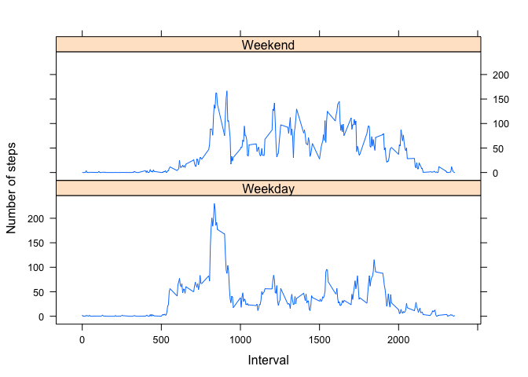

## Loading and preprocessing the data

```r
unzip("activity.zip")
activity <- read.csv("activity.csv")
options(scipen=999)
```

## What is mean total number of steps taken per day?

```r
actsum <- aggregate(activity$steps, by = list(activity$date), FUN = sum, na.rm = TRUE)
x <- round(mean(actsum$x))
y <- round(median(actsum$x))
```
The mean number of steps taken per day is 9354 and the median number of steps taken per day is 10395


```r
hist(actsum$x, main = "Histogram of total steps taken per day", xlab = "Number of steps taken")
abline(v = mean(actsum$x), lwd = 2, col = "red")
abline(v = median(actsum$x), lwd = 2, col = "blue")
legend("topright", col = c("red", "blue"), legend = c("mean", "median"), lwd = 2)
```

<!-- -->

## What is the average daily activity pattern?

```r
actint <- aggregate(activity$steps, by = list(activity$interval), FUN = mean, na.rm = TRUE)
plot(type = "l", y= actint$x, x = actint$Group.1, main = " Time series of average steps taken", xlab = "5 minute interval", ylab = "Steps taken")
```

<!-- -->


```r
z <- round(actint[max(actint$x),]$Group.1)
```
On average across all the days in the dataset, the maximum 5-min interval is: 1705

## Imputing missing values

```r
sumact <- round(sum(is.na(activity)))
actintna <- ave(activity$steps, activity$interval, FUN = function(x) mean(x, na.rm = TRUE))
activity2 <- activity
for(i in 1:dim(activity2)[1]){
if(is.na(activity2$steps[i])){
    activity2$steps[i] <- actintna[i]
}
}
actsum2 <- aggregate(activity2$steps, by = list(activity2$date), FUN = sum, na.rm = TRUE)
newx <- round(mean(actsum2$x))
newy <- round(median(actsum2$x))
meandiff <- round(mean(actsum2$x) - mean(actsum$x))
mediandiff <- round(median(actsum2$x) - median(actsum$x))
```
- The number of missing values in the dataset: 2304
- Missing values have been replaced by the mean for that 5-minute interval
- The new mean of steps taken per day: 10766 
- The new median of steps taken per day: 10766
- The difference between the old and new mean is 1412
- The difference between the old and new median is 371


```r
hist(actsum2$x, main = "Histogram of total steps taken per day", xlab = "Number of steps taken")
abline(v = mean(actsum2$x), lwd = 2, col = "red")
abline(v = median(actsum2$x), lwd = 2, col = "blue")
legend("topright", col = c("red", "blue"), legend = c("mean", "median"), lwd = 2)
```

<!-- -->

## Are there differences in activity patterns between weekdays and weekends?

```r
library("lattice")
week <- (weekdays(as.POSIXct(activity2$date)))
week <- gsub("Monday|Tuesday|Wednesday|Thursday|Friday","Weekday",week)
week <- gsub("Saturday|Sunday","Weekend",week)
activity2$week <- factor(week)
actint2 <- aggregate(activity2$steps, by = list(activity2$interval,activity2$week), FUN = mean, na.rm = TRUE)
names(actint2) <- c("interval","week","steps")
xyplot(steps~interval | week, data = actint2, type = "l", ylab = "Number of steps", xlab = "Interval", layout = c(1,2))
```

<!-- -->
